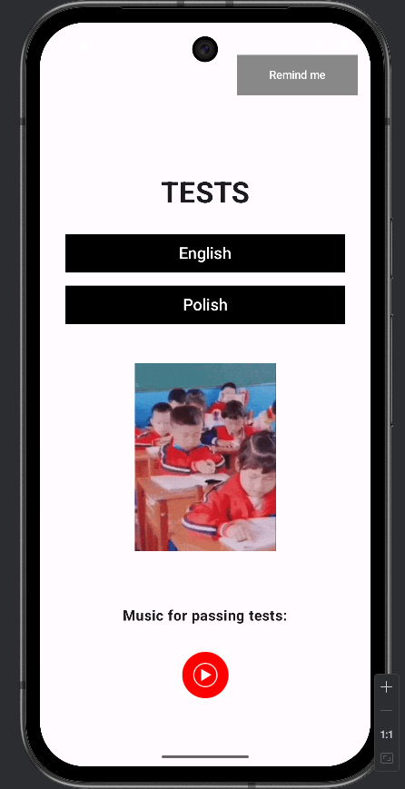
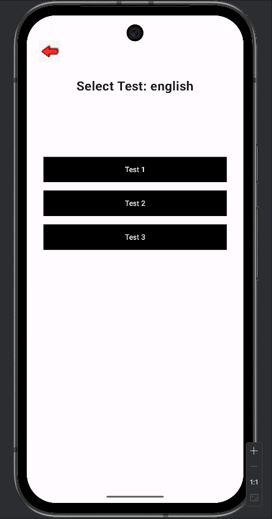
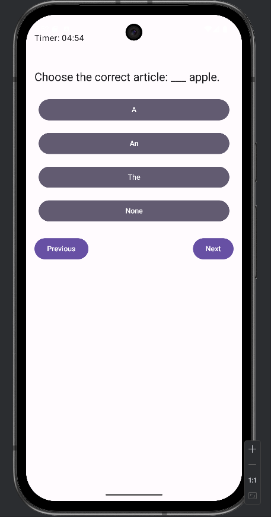
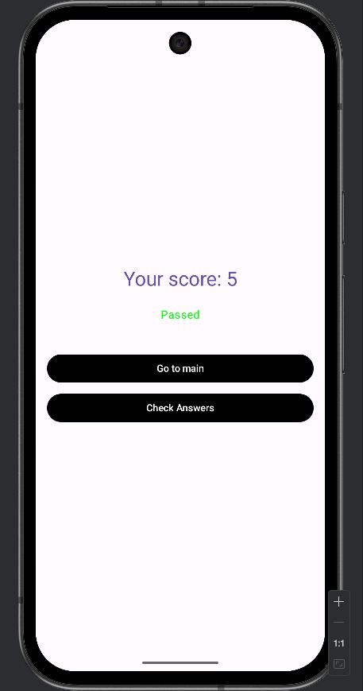
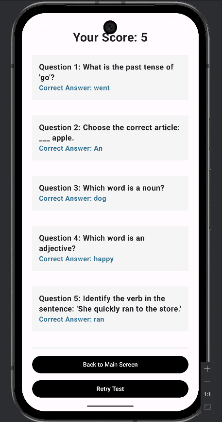

# Poly-Glot Quiz App 🌍📱

An interactive Android application built with **Jetpack Compose** designed for learning and testing language skills (English and Polish). The app features real-time testing, progress tracking via Firebase, and motivational content.

## ✨ Features

- **Multi-language Support:** Choose between English and Polish language tests.
- **Dynamic Quiz Engine:** Timed tests (5 minutes) with various question types (Grammar, Vocabulary).
- **Giphy Integration:** Motivational GIFs fetched via Giphy API to keep learners engaged.
- **Cloud Integration:** Test results are automatically saved to **Firebase Firestore**.
- **Local Notifications:** - Daily reminders to study.
    - Immediate feedback notifications after finishing a test.
- **Music Integration:** Quick access to your favorite music apps for a better study environment.
- **Result Review:** Detailed breakdown of correct answers after each test session.

## 🛠 Tech Stack

- **UI:** Jetpack Compose (Modern Android Toolkit)
- **Navigation:** Compose Navigation
- **Networking:** Retrofit 2 & Gson (for Giphy API)
- **Image Loading:** Coil
- **Backend:** Firebase Firestore
- **Architecture:** MVVM-ready structure with `rememberSaveable` for state management.

## 📸 Screenshots

| Main Screen | Test Selection | Quiz Interface | Test Results | Check Answers |
|:---:|:---:|:---:|:---:|:---:|
|  |  |  |  |  |

## 🚀 Getting Started

### Prerequisites
- Android Studio Flamingo or newer.
- A Giphy API Key.
- A Firebase Project (with `google-services.json`).

### Installation
1. Clone the repository:
    ```bash 
    git clone [https://github.com/r0mch1kk/Poly-Glot_Quiz_App.git](https://github.com/r0mch1kk/Poly-Glot_Quiz_App.git)

2. Add your google-services.json to the app/ directory.

3. Open local.properties in the root folder and add your API key:
    ```properties
    GIPHY_API_KEY=your_api_key_here

4. Build and run the app on your emulator or physical device.

### 📁 Project Structure
- **TestQuestions.kt**: Hardcoded database of language questions.

- **Navigation.kt**: Centralized navigation logic using NavHost.

- **TestScreen.kt**: Core quiz logic including the countdown timer and Firebase saving.

- **GiphyApiService.kt**: Retrofit setup for external API calls.

- **NotificationReceiver.kt**: Handles background reminder logic.

### 🛡 Security Note
This project uses Firebase. Ensure your Firestore Security Rules are configured correctly.